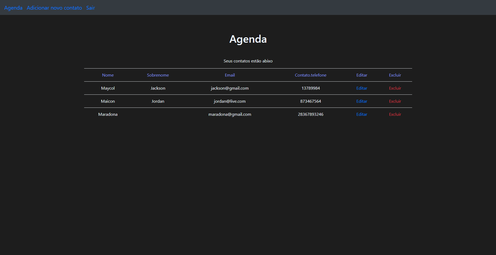

# **Agenda**
 Projeto de uma agenda de contatos usando o padrão full MVC, foi usado node com mongoDb como banco de dados, já o view foi feito com Ejs e Bootstrap.

 
 
# Como iniciar

Primeiro baixe as dependências com.
```
npm i
```

Crie um arquivo .env na pasta raiz do projeto, após isso crie uma variável chamada "connectString" e atribua a ela o link de conexão do seu DataBase do mongoDb.
```
connectString="url"
```

Coloque no terminal.
```
npm start 
```
